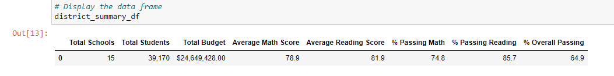
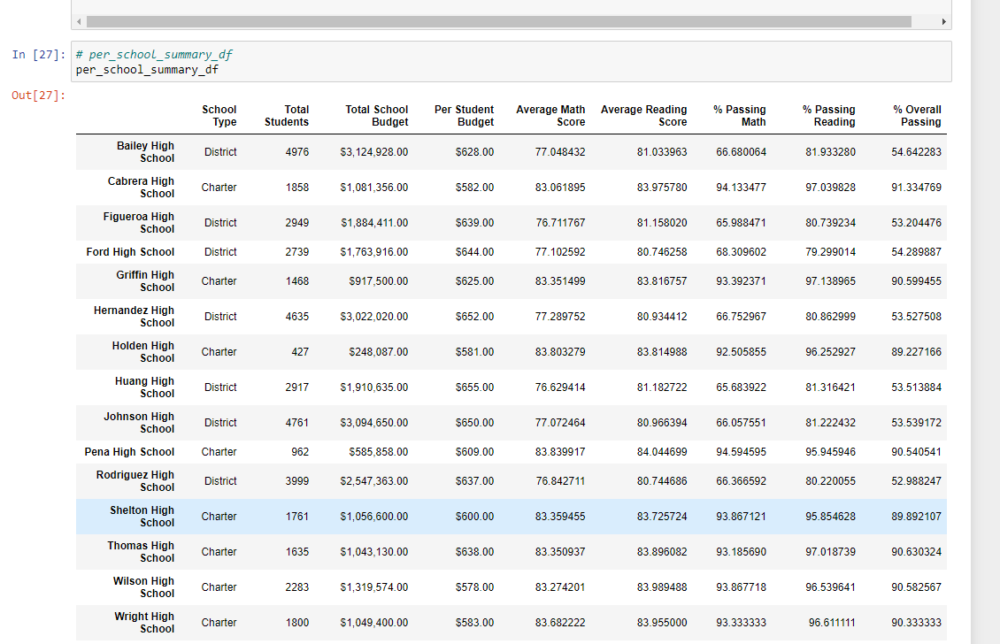
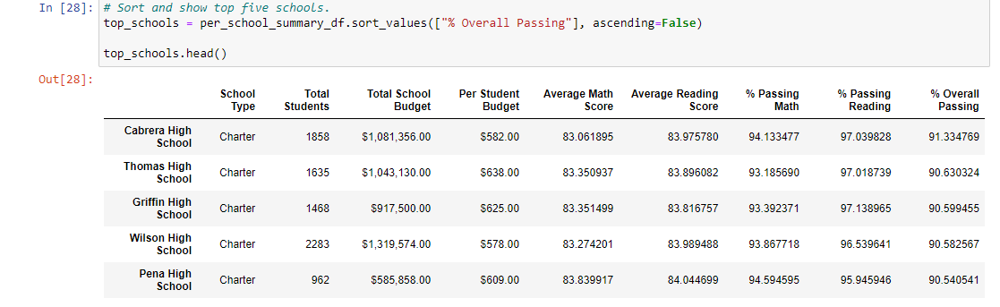
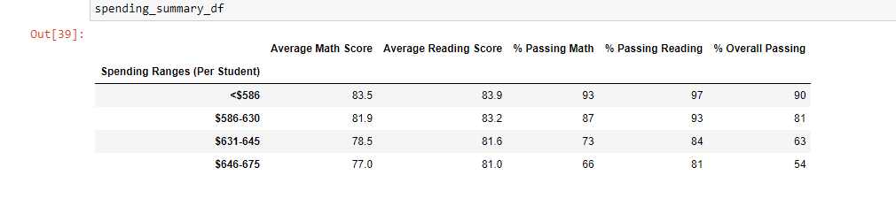
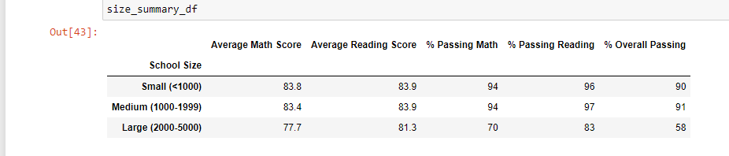
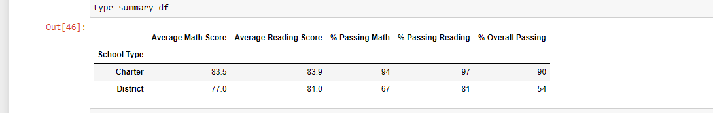

# School_District_Analysis

## Overview

I have been working with Maria in the PyCities School District to summarize district-wide school and student performance data using Pandas and Jupyter Notebook. After submitting our final reports to the district school board, the board informed us that there was evidence of academic dishonesty in our student data, and that the Thomas High School's 9th Grade Math and Reading grades appear to be altered. We have been tasked with replacing the THS 9th Grade's scores with NaN values and repeating our analysis. 

### Results

Now that our analysis is complete, we will address a number of outstanding questions. 

- **District Summary:**
  Our district-wide summary (seen below) wasn't affected much by the removal of the THS 9th Grade grades. 
  
   We only see around two tenths of a reduction in the percentage of students passing math and one tenth of a reduction in the percentage of students passing reading. Our overall passing percentage was reduced by 3 tenths of a percentage point. 
  
- **School Summary:**
  Our school summary (seen below) also showed very little change from the previous summary run with the THS 9th Grade data included. THS saw a slight decrease in its average math score, but a slight increase in its average reading score.
 
 
- **THS Relative to Other Schools:**
  THS saw no change to its position in school rankings as a result of replacing its 9th Grade math and reading scores. Prior to the change, it was placed in the 2nd position overall with an overall passing percentage rate of 90.95%, and even with a reduction to 90.63% after the change, still placed above the 3rd placing school's rate of 90.60%. 
  

- **Additional Affects:**

  - *Math and Reading Scores by Grade*
  
    Unfortunately here there is now simply an absence of data for THS' 9th Grade, whereas before there were averages of math and reading scores, respectively. 
    
  - *Scores by School Spending*
  
    Removing the THS 9th Grade scores changed no data in the Scores by School Spending summary at this level of view - I would expect to see some changes in the range of the hundredths or thousandths of percentage points given that we saw changes in the ranges of tenths of percentage points when viewing the changes only at the THS level. 
    
    
  - *Scores by School Size*
  
    As we saw with Scores by School Spending, I think because we are looking at multiple schools, many more students than those from only THS, and the fact that our scale of percentage ratings do not go into decimals, we are not viewing any discernable changes in this summary due to removing the THS 9th Grade scores. 
     
     
  - *Scores by School Type*

    I also wasn't surprised to see no changes here, as with the previous two summaries, we are looking at all of our schools condensed into a small number of categories, this time just two, so a change that produced only a tenth of a percentage change in a single school wouldn't register in two groupings of all schools rounding measurements on a tenth of a percentage point. 
    
    
    
### Summary

After replacing the THS 9th Grade student math and reading scores with NaN values, we can observe four changes in our summary data:
- 
